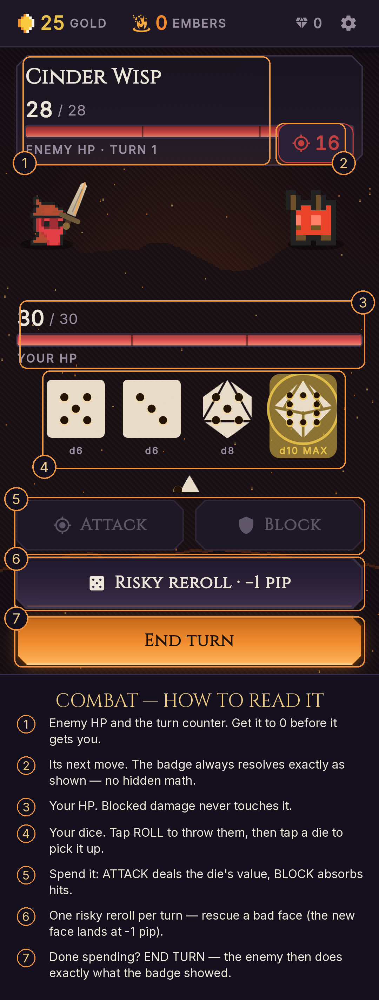
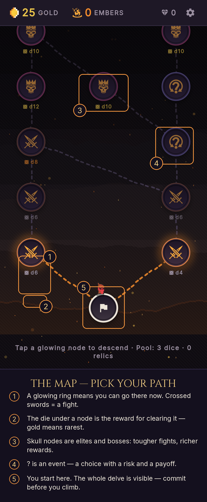
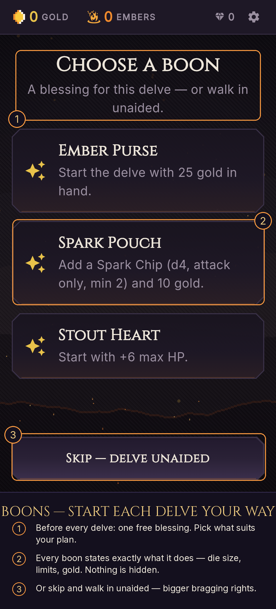
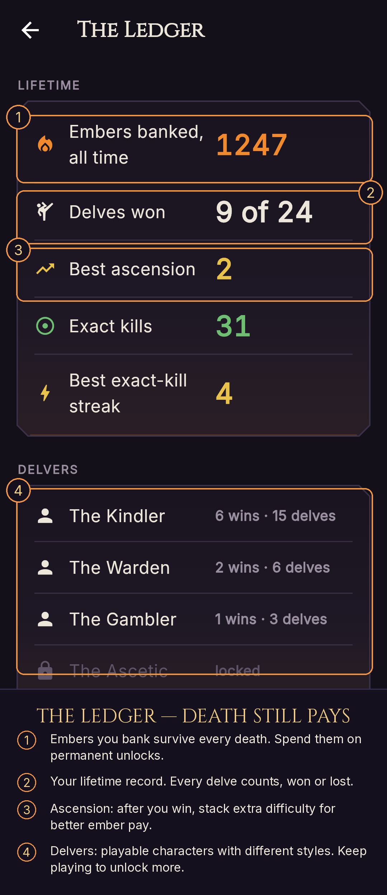

# How to play Emberdelve — annotated guide

Four annotated screens that explain every UI element a new player meets, in
the order they meet them. The callout copy mirrors the in-game guided tour
(`lib/ui/screens/tour_overlay.dart`) and the map/meta semantics in code, so
this page never drifts from what the game actually says.

Regenerate after any UI change:

```sh
python3 tool/annotate_howto_screenshots.py
```

(Reads the raw store screenshots in `docs/store/screenshots/`, writes the
annotated plates to `docs/store/screenshots/howto/`.)

## 1 · Combat — how to read it



1. **Enemy HP and the turn counter.** Get it to 0 before it gets you.
2. **Its next move.** The badge always resolves exactly as shown — no hidden math.
3. **Your HP.** Blocked damage never touches it.
4. **Your dice.** Tap ROLL to throw them, then tap a die to pick it up.
5. **Spend it:** ATTACK deals the die's value, BLOCK absorbs hits.
6. **One risky reroll per turn** — rescue a bad face (the new face lands at −1 pip).
7. **END TURN** — the enemy then does exactly what the badge showed.

## 2 · The map — pick your path



1. **A glowing ring** means you can go there now. Crossed swords = a fight.
2. **The die under a node** is the reward for clearing it — gold means rarest.
3. **Skull nodes** are elites and bosses: tougher fights, richer rewards.
4. **?** is an event — a choice with a risk and a payoff.
5. **You start here.** The whole delve is visible — commit before you climb.

## 3 · Boons — start each delve your way



1. **Before every delve: one free blessing.** Pick what suits your plan.
2. **Every boon states exactly what it does** — die size, limits, gold. Nothing is hidden.
3. **Or skip and walk in unaided** — bigger bragging rights.

## 4 · The Ledger — death still pays



1. **Embers you bank survive every death.** Spend them on permanent unlocks.
2. **Your lifetime record.** Every delve counts, won or lost.
3. **Ascension:** after you win, stack extra difficulty for better ember pay.
4. **Delvers:** playable characters with different styles. Keep playing to unlock more.
