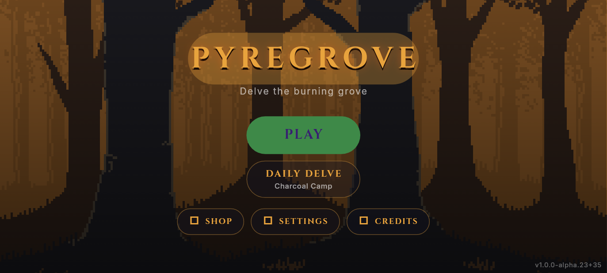
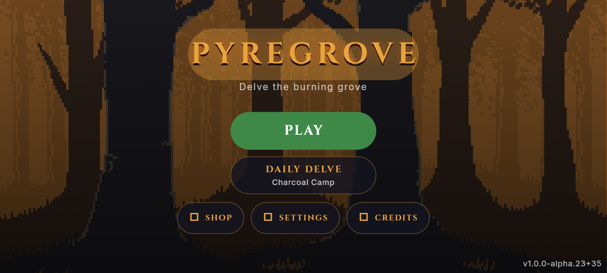
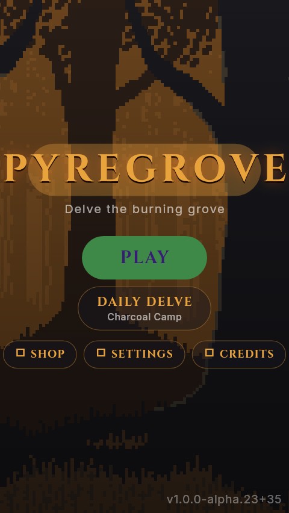
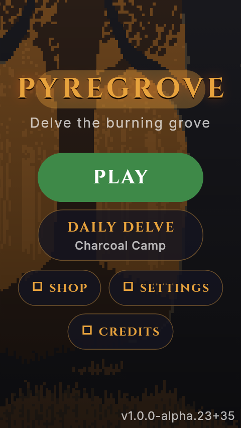

# Pyregrove title readability / navigation

## Plan

Preserve CC0 forest art, Cinzel gold wordmark, green PLAY, first-run routing,
daily seed and save behavior. The current whole-menu FittedBox shrinks labels
and touch targets to satisfy the overflow sweep; that is not readable reflow.

Use a scroll-safe, width-clamped menu with a decorative wordmark scaled
independently. Let the secondary action row wrap. Retain a clear PLAY hierarchy,
raise the Daily subtitle/build label to 12px, and respect reduced-motion settings
for the existing ambient forest animation. No new dependency or generated art.

## Verification

Existing analyzer/full tests stay unchanged. Add real-font before/after title
plates at portrait 320×568 (1.3× text), landscape 568×320 (1.3×), 915×412 and
1280×720. Added pins require >=48px visible PLAY target after transform and
secondary routes reachable without scaled-down text.

Use the existing public CI mirror only. Private signing material and histories
are never copied here. No tag, release, Android signing, deployment or version bump.

Baseline helper CI 33950045156 failed analyzer on one new-helper issue:
`The import of 'dart:typed_data' is unnecessary because all of the used elements
are also provided by the import of 'package:flutter/services.dart'.`
Corrective retry removes only that redundant import. No assertion or old test changes.

## Result and review limits

VERIFIED: baseline run [33950100697](https://github.com/tapiwamakandigona/pyregrove-ci/actions/runs/33950100697)
at 32c7cb8: analyzer clean, 591 passed / 2 failed / 1 skipped. Both new failures
identified the menu-wide FittedBox. Source-only change ac86c95 passed
[33950210756](https://github.com/tapiwamakandigona/pyregrove-ci/actions/runs/33950210756):
analyzer clean, 593 passed / 1 skipped.

VERIFIED: all 371 original application/assets/test/dependency files match the
tested public tree; only title_screen differs from the baseline. The additional
test is identical. Before/after PNGs and checksums are in `visual/2026-09-05/`.
Automated measurements confirm reflow, target size, route-label reachability
and no captured layout exception. A human pixel review and physical-device feel
are not certified by these checks. Existing phone/release gates stay false.

VERIFIED: private workflow 346853488 is `disabled_manually`, read back through
the API and managed CLI. Public PR CI remains active. No signing material,
private Git history, purchase, tag, release, deployment or version change.

### Representative renders

| Before | After |
|---|---|
|  |  |
|  |  |
